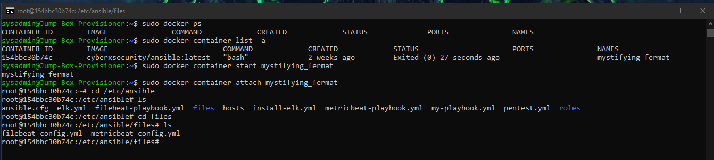
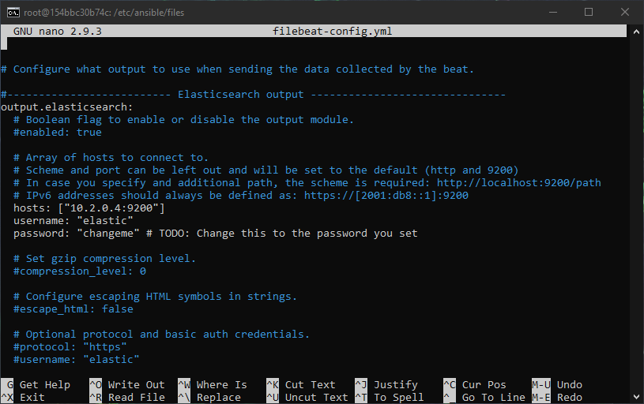
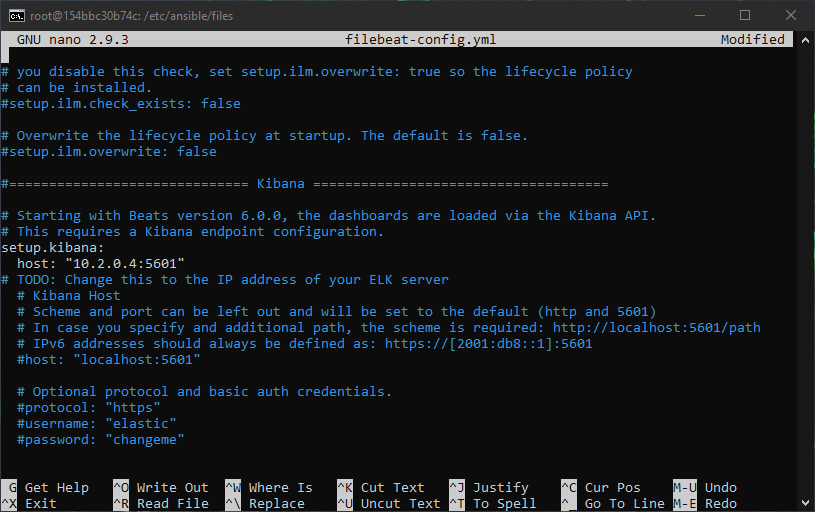
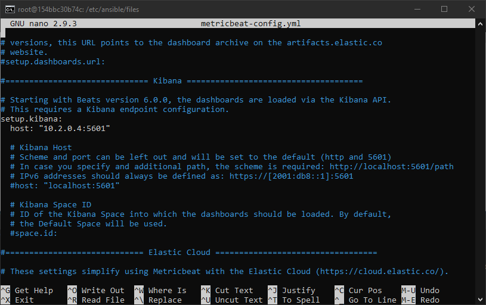
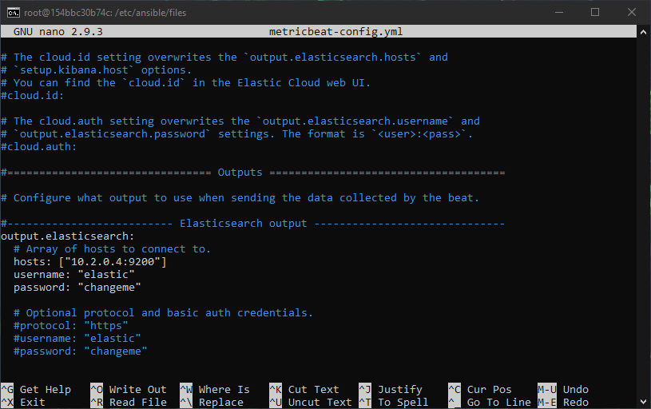

# GT-Edu-project
ELK-Stack in Azure

# Automated ELK Stack Deployment

The files in this repository were used to configure the network depicted below.

These files have been tested and used to generate a live ELK deployment on Azure. They can be used to either recreate the entire deployment pictured above. Alternatively, select portions of the file may be used to install only certain pieces of it.

This document contains the following details:
- Description of the Topology
- Access Policies
- ELK Configuration
  - Beats in Use
  - Machines Being Monitored
- How to build and use ansible to automate and deploy on docker containers and monitor those web servers.

### Description of the Topology

The main purpose of this network is to expose a load-balanced and monitored instance of DVWA, the D*mn Vulnerable Web Application.
Load balancing ensures that the application will be highly avalable, in addition to restricting access to the network.
The load balancer ensures that the work to process incoming traffic will be shared across all three vulnerable web servers.  Access controls will ensure that only autherized users can connect to the inter virtual network 

Integrating an ELK server allows Admin to easily monitor the vulnerable VMs for system traffic, logs, metrics and system changes.
 
  -Filebeat watches for log files/locations and collect log events.
    
  -Metricbeat records metrics and statistical data from the operating system and from services running on the server.

The configuration details of each machine may be found below.

| Name          | Function            | Public IP Address | Private IP Address | Operating system | 
|---------------|---------------------|-------------------|--------------------|------------------|
| Jump Box      | Gateway w/ Ansible  | 52.146.87.161     | 10.0.0.4           | Linux ubuntu     |
| Web 1         | Docker w/ DVWA      | No Public IP      | 10.0.0.10          | Linux ubuntu     |
| Web 2         | Docker w/ DVWA      | No Public IP      | 10.0.0.11          | Linux ubuntu     |
| Web 3         | Docker w/ DVWA      | No Public IP      | 10.0.0.12          | Linux ubuntu     |
| ELK Server    | Docker w/ ELK Stack | 168.61.178.12     | 10.2.0.4           | Linux ubuntu     |
| Load Balancer | Load Balancing      | 52.224.192.76     | No Private IP      |                  |

A load balancer with a health probe has been provisioned in front of the 3 DVWA web server VM's.

  -Avalibility zone 1: JumpBox, Load Balancer, DVWA Web server 1-3
  
  -Avalibility zone 2: ELK Server

### Access Policies

A summary of the access policies in place can be found below

ACL's (access control lists) were set up to allow only inbound connections from white listed Ip Addresses to the Jump Box VM which can then communicate with all other servers through the ansible container over SSH port 22 utilizing SSH public keys for security. 

| VM Name       | Public Access | Public Port | Private IP Access | Private Port |
|---------------|---------------|-------------|-------------------|--------------|
| Jump Box      | 52.146.87.161 | 22          | 10.0.0.4          | 22           |
| Load Balancer | 52.224.192.76 |             |                   |              |
| DVWA Web1     | 52.224.192.76 | 80          | 10.0.0.10         | 22           |
| DVWA Web2     | 52.224.192.76 | 80          | 10.0.0.11         | 22           |
| DVWA Web3     | 52.224.192.76 | 80          | 10.0.0.12         | 22           |
| ELK Server    | 168.61.178.12 | 5601        | 10.2.0.1          | 22           |

The web servers can accept HTTP traffic through the load balancer but have no public facing IP Address. The Elk Server could be accessed over HTTP port 5601 to examine the monitored data.

## ELK Server Configuration

It is usually a good practice to update the system before adding new systems and/or software:

Updates for the jumpbox can be done using:
    sudo apt update
    sudo apt upgrade

or from the ansible or any of the other web server shells 
    'sudo' apt update
    'sudo' apt upgrade

sudo does not need to be used from "root"

Ansible was used to automate configuration of the ELK machine. No configuration was performed manually, The advantage of automating the installation process is that multiple server deployments can be accomplished easily and quickly without having to physically touch each server.

The ELK VM exposes an Elastic Stack instance. **Docker** is used to download and manage an ELK container.

Rather than configure ELK manually, we opted to develop a reusable Ansible Playbook to accomplish the task.

  [install-elk.yml](install-elk.yml)

This playbook implements the following tasks:

  -Install Docker.io and pip3
  -Increases VM memory
  -Download and Configure elk docker container
  -Sets Published Ports

### Target Machines & Beats

This ELK server is configured to monitor the following machines:

| VM Machine  | Function | private IP |
|-------------|----------|------------|
| Web1 Server | DVWA     | 10.0.0.10  |
| Web2 Server | DVWA     | 10.0.0.11  |
| Web3 Server | DVWA     | 10.0.0.12  |

The following Beats have been installed on these VM's:
  
  -Filebeat is a lightweight shipper for forwarding and centralizing log data. Installed as an agent on a server, Filebeat monitors the log files or locations specified and collects log events
  
  -Metricbeat is a lightweight shipper that can be install on a server to collect metrics from the operating system and from services running on the server.

### Using the Playbook

In order to use the playbook, the Ansible control node will need to be configured: 

SSH into the Jump Box:

    -Filebeat
  
  #Note that when text is copy and pasted from the web into terminal, formatting differences may occur that will corrupt this configuration file. That chance increase with the size of the file.

Using curl is a better way to avoid errors and we have the file hosted for public download

Run: mkdir /etc/ansible/files && curl https://gist.githubusercontent.com/slape/5cc350109583af6cbe577bbcc0710c93/raw/eca603b72586fbe148c11f9c87bf96a63cb25760/Filebeat >> /etc/ansible/files/filebeat-config.yml

[filebeat-configuration.yml](Filebeat/filebeat-config.yml)

After downloading the file, the IP Address for the ELk-Server will need to be added to the configuration in 2 places
the utilization of the short cut "shift" + "control" + "-" will allow quick referenceing of the lines thata need to be modified "1105" and "1805"

When the configuration files for filebeat has been installed and modified with the correct address the playbook file can then be saved in the /etc/ansible directory as seen in the first image in this section.

[filebeat-playbook.yml](Filebeat/filebeat-playbook.yml)

The playbook can be RUN from the /etc/ansible directory or with absolute path
  - "ansible-playbook filebeat-playbook.yml"

  -Metricbeat
  
  
[metricbeat-configuration.yml](Metricbeat/metricbeat-config.yml)

After installing the configuration file, it will need to be modified with the IP address of the ELK-server also

When the configuration files for metricbeat has been installed and modified with the correct address the playbook file can then be saved in the /etc/ansible directory as seen in the first image in this section.

[metricbeat-playbook.yml](Metricbeat/metricbeat-playbook.yml)

The playbook can be RUN from the /etc/ansible directory or with absolute path
  - "ansible-playbook metricbeat-playbook.yml"

- Run the playbook, and navigate to  http://168.61.178.12:5601/app/kibanato check that the installation worked as expected.

